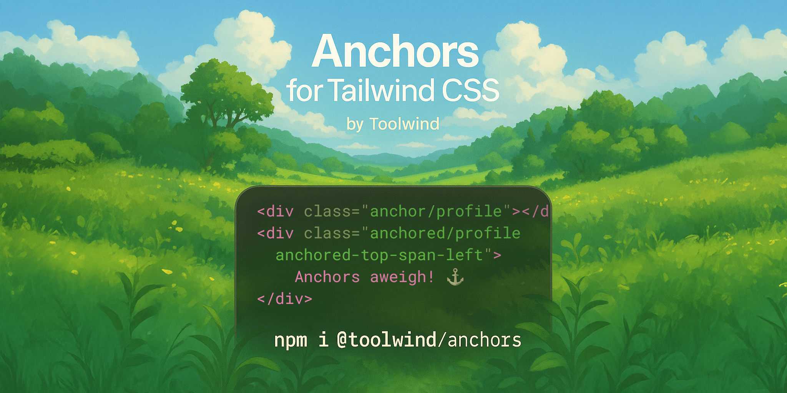

<h5 align="center"><small><i>Anchors for Tailwind CSS</i></small></h5>

<!--<div align="center"> I'll re-add these badges when they're working. I think they're still propagating.

[](https://bundlephobia.com/package/@toolwind/anchors)
[](https://github.com/brandonmcconnell/@toolwind/anchors/blob/main/LICENSE)
[](https://www.npmjs.com/package/@toolwind/anchors)
[](https://twitter.com/branmcconnell)

</div>-->

---

**Anchors for Tailwind CSS** is a plugin that brings declarative support for the CSS Anchor Positioning API to Tailwind, allowing you to define and position elements relative to custom anchors. It adds utilities for `anchor-name`, `position-anchor`, `position-area`, `anchor()` and `anchor-size()` expressions.

It also lays the groundwork for using View Transitions to animate any anchored elements, which would require separate JS (for now 👀).

## Installation

1. Install the plugin from npm with your preferred package manager:
    
    ```bash
    npm install -D @toolwind/anchors
    ```
2. Then include it in your Tailwind CSS or JS config file:
    
    <details name="install-lang" open><summary><b>CSS (Tailwind CSS v4+)</b></summary>

    ```css
    /* style.css */
    @import "@toolwind/anchors";
    ```

    </details><details name="install-lang"><summary><b>JS (Tailwind CSS v3 compatible)</b></summary>

    ```js
    // tailwind.config.js
    import anchors from "@toolwind/anchors";
    ```

    </details>

## Usage

### Defining an anchor

Use the `anchor/{name}` utility to define an anchor point. The CSS `anchor-name` property requires a dashed ident type (e.g. `--my-anchor`). For convenience, Anchors for Tailwind CSS automatically converts simpler ident types (e.g. `my-anchor`) names into dashed idents under the hood.

There are several ways to define an anchor:

1. **Use a non-dashed ident** (e.g. `my-anchor`)

    ```html
    <div class="anchor/my-anchor"></div>
    ```

    This utlity generates the below CSS, prefixed with `--tw-anchor_` since CSS `anchor-name` property requires a dashed ident type (e.g. `--my-anchor`), as mentioned previously:

    ```css
    .anchor\/my-anchor {
      anchor-name: --tw-anchor_my-anchor;
    }
    ```

2. **Use a dashed ident** (e.g. `--my-anchor`)

    If you explicitly specify a dashed ident as an anchor name, this utility will preserve that dashed ident so you can re-use it elsewhere more easily.

    ```html
    <div class="anchor/--my-anchor"></div>
    ```

    This will generate the following CSS:

    ```css
    .anchor\/--my-anchor {
      anchor-name: --my-anchor;
    }
    ```

3. **Use an arbitrary value** (e.g. `[var(--x)]` or `[--my-anchor]`)

    🚧 Note that names passed via an arbitrary value (square bracket syntax) must be or resolve to a dashed ident.

    1. **Include a variable reference inside an arbitrary value** (e.g. `[var(--x)]`)

        If you want to pass a name via a CSS variable, you can do so using an arbitrary value (square bracket syntax), like this:

        ```html
        <div class="[--x:--my-anchor]">
          <div class="anchor/[var(--x)]"></div>
        </div>
        ```

        This will generate the following CSS:

        ```css
        .anchor\/\[var\(--x\)\] {
          anchor-name: var(--x);
        }
        .\[--x\:--my-anchor\] {
          --x: var(--my-anchor);
        }
        ```

        For an even simpler syntax, take a look at the variable shorthand syntax under point **4** below.

    2. **Include dashed ident inside arbitrary value** (e.g. `[--my-anchor]`)

        You can directly pass a dashed ident using the square bracket syntax:

        ```html
        <div class="anchor/[--my-anchor]"></div>
        ```

        This will generate the following CSS:

        ```css
        .anchor\/\[--my-anchor\] {
          anchor-name: --my-anchor;
        }
        ```

        However, while this approach works, it is equivalent to using the dashed ident syntax shown in example 2 (`anchor/--my-anchor`), which is simpler.

        > [!WARNING]
        > Note that Tailwind v3.x treats this syntax as differently, and will process `anchor/[--my-anchor]` as `anchor-name: var(--my-anchor)` instead of `anchor-name: --my-anchor`, as it uses this as the syntax for variable shorthand syntax. See point **4** below for more information.
  
4. **Pass a variable using variable shorthand syntax**

    1. Tailwind CSS v4.x

        In Tailwind CSS v4.x and above, you can use this shorthand below instead of passing a custom property reference to an arbitrary value (square bracket syntax).

        These two utilities are equivalent, and will both produce `anchor-name: var(--x)`:

        ```html
        <div class="anchor/[var(--x)]"></div>
        <div class="anchor/(--x)"></div>
        ```

        > [!IMPORTANT]
        > This is not the same as `anchor/--my-anchor` or `anchor/[--my-anchor]`, as they pass the dashed ident itself directly, where the variable shorthand syntax wraps its value in `var()`.

    2. Tailwind CSS v3.x (≥ 3.3 and above)

        Using variable shorthand syntax in Tailwind v3.x (≥ 3.3 and above), you can use square brackets to reference CSS variables, similarly to the v4 example above, only using square brackets instead of parentheses.

        These two utilities are equivalent, and will both produce `anchor-name: var(--x)`:

        ```html
        <div class="anchor/[var(--x)]"></div>
        <div class="anchor/[--x]"></div>
        ```

        > [!IMPORTANT]
        > This behavior differs from Tailwind CSS v4 and newer, where `anchor/[--x]` would pass the dashed ident directly. In Tailwind CSS v3, if you want to pass the dashed ident directly without wrapping it in `var()`, use the dashed ident syntax shown in example 2 above.

### Positioning relative to an anchor

Once an anchor has been defined, you can anchor other elements to it.

* **Anchoring:** Attach an element to an anchor

    Use `anchored/{name}` to attach an element to an anchor:

    ```html
    <div class="anchored/my-anchor"></div>
    ```
    ```css
    {
      position-anchor: --tw-anchor_my-anchor;
      :where(&) {
        position: absolute;
        view-transition-name: --tw-anchor-view-transition-313d192p322r2w3336;
      }
    }
    ```

* **Positioning:** Position an element relative its linked anchor

    Use `anchored-{side}` to specify the position area of the anchored element. For example, `anchored-top-center` will position the element at the top center of its anchor, touching the anchored element:

    ```html
    <div class="anchored-top-center"></div>
    ```
    ```css
    {
      position-area: top center;
    }
    ```

* **Shorthand:** Anchor _and_ position an element relative to an anchor

    Use `anchored-{side}/{name}` to combine anchoring and positioning in a single utility:

    ```html
    <div class="anchored-top-center/my-anchor"></div>
    ```
    ```css
    {
      position-anchor: --tw-anchor_my-anchor;
      position-area: top center;
      :where(&) {
        position: absolute;
        view-transition-name: --tw-anchor-view-transition-313d192p322r2w3336;
      }
    }
    ```

> [!IMPORTANT]
> A quick note on the use of `:where()` here:
>
> Using `:where()` in a CSS selector resets the specificity of the styles declared inside that selector's block to zero, meaning they hold the lowest priority in selector matching. This makes it extremely easy for you to override these values.
> 
> Because this plugin sets both `position` and `view-transition-name` with zero specificity, you can override both of these styles with ease without having to worry about using `!` (`!important`) on your overriding styles. making them easy to overwrite with other values, if you choose. 
> 
> As a rule of thumb, anchored elements must use absolute or fixed positioning. This plugin defaults to `absolute` positioning, but you can add `fixed` to use fixed positioning instead for any anchored element.
>
> Because of the way the `view-transition-name` value is encoded, it really shouldn't conflict with any of your other styles, but if you wish to opt of that being applied as well, you can simple add `[view-transition-name:none]` to your classes for the anchored element (alongside the `anchored` utility classes).

## Supported Utilities

* ### `anchor/{name}`

    Sets `anchor-name`

* ### `anchored/{name}`

    Sets: `position-anchor`

* ### `anchored-{position}`

    Sets `position-area`. Examples:
    - `anchored-top-center` → `top center`
    - `anchored-bottom-span-left` → `bottom span-left`
    - `anchored-right` → `right`

* ### `{top|right|bottom|left|inset}-anchor-{side}-{offset}/{name?}`

    Generates explicit directional positioning using `anchor()`:

    ```html
    <div class="top-anchor-bottom"></div>
    ```

    Results in:

    ```css
    top: anchor(bottom);
    ```

    With offset support:

    ```html
    <div class="top-anchor-bottom-4"></div>
    ```

    ```css
    top: calc(anchor(bottom) + 1rem);
    ```

* ### `{w|h}-anchor{-size?}/{name?}]`

    Sets size utilities using `anchor-size()`:
    
    - **Omitting the anchor size (i.e. default size/dimension)**
    
      `w-anchor` → `width: anchor-size(width)`
    
      If a size is omitted, the size value is set to the same size on the linked anchor element for the property being set.
    
      For example, (`w-anchor`) would set `width: anchor-size()`, which is equivalent to `width: anchor-size(width)`, setting the width of the anchored element equal to the width of its linked anchor.
    
      For further reading: [`anchor-size#anchor-size` (MDN)](https://developer.mozilla.org/en-US/docs/Web/CSS/anchor-size#anchor-size)
    - **Declaring the anchor-size (width/height/etc.) to use as a length**
    
      `w-anchor-height` → `width: anchor-size(height)`
    
      This example sets the anchored element's width to the height of its linked anchor element. This is useful when you want to create elements with dimensions based on different aspects of their anchor elements.
    - **Setting/omitting the anchor name**
    
      * `w-anchor` → `width: anchor-size(width)` 
      * `w-anchor/--name` → `width: anchor-size(--name width)` 
      * `w-anchor/name` → `width: anchor-size(--tw-anchor_name width)` 
    
      Specifying an anchor name on an anchor size utility is entirely optional when setting sizes relevant to an anchored element's linked anchor element.
      
      However, it only defines which anchor the element's property values should be set relative to.
    
      For further reading: [`anchor-size#anchor-size` (MDN)](https://developer.mozilla.org/en-US/docs/Web/CSS/anchor-size#anchor-size)

## View Transition API Integration

Every `anchored/{name}` class includes a `view-transition-name`, making your anchored elements animatable with `document.startViewTransition()`:

```js
document.startViewTransition(() => {
  el.classList.remove('anchored-top-left')
  el.classList.add('anchored-bottom-right')
})
```

This animates position shifts smoothly using the browser-native View Transitions API.

## Why use Anchors for Tailwind CSS? 🤔

- Declarative anchor positioning with Tailwind utility syntax
- Full support for native anchor-related CSS properties and functions
- Easy offset control via `calc(anchor(...) + theme spacing)` _(under the hood)_
- Built-in support for View Transitions
- Fully JIT-compatible, no runtime required

## Additional Resources 📚

- MDN: [Guide: Using CSS anchor positioning](https://developer.mozilla.org/en-US/docs/Web/CSS/CSS_anchor_positioning/Using) | [anchor-size()](https://developer.mozilla.org/en-US/docs/Web/CSS/anchor-size) | [anchor()](https://developer.mozilla.org/en-US/docs/Web/CSS/anchor) | [anchor-name](https://developer.mozilla.org/en-US/docs/Web/CSS/anchor-name) | [position-anchor](https://developer.mozilla.org/en-US/docs/Web/CSS/position-anchor) | [position-area](https://developer.mozilla.org/en-US/docs/Web/CSS/position-area) | [position-try-order](https://developer.mozilla.org/en-US/docs/Web/CSS/position-try-order)
- CSS Tricks: [CSS Anchor Positioning Guide](https://css-tricks.com/css-anchor-positioning-guide/)
- Specification: [CSS Anchor Positioning](https://drafts.csswg.org/css-anchor-position-1/)
- [The Anchor Tool](https://anchor-tool.com/) 👈 probably the best way to get a real fast introduction to the CSS Anchor Positioning API, how it works, and how helpful it can be ✨
- [@Una](https://github.com/una)! I've never met anyone more fired up about CSS Anchor Positioning than Una Kravets, so definitely check out some of the things she's posted about it. I'm not 100% certain, but I think she may have actually created the [The Anchor Tool](https://anchor-tool.com/) mentioned above.

## If you liked this plugin...

Check out more by [@branmcconnell](https://github.com/brandonmcconnell):

- [tailwindcss-signals](https://github.com/brandonmcconnell/tailwindcss-signals): React to parent or ancestor state
- [tailwindcss-members](https://github.com/brandonmcconnell/tailwindcss-members): Style based on child/descendant state
- [tailwindcss-mixins](https://github.com/brandonmcconnell/tailwindcss-mixins): Reusable, aliased groups of utilities
- [tailwindcss-selector-patterns](https://github.com/brandonmcconnell/tailwindcss-selector-patterns): Dynamic selector composition
- [tailwindcss-directional-shadows](https://github.com/brandonmcconnell/tailwindcss-directional-shadows): Shadows with directional awareness
- [tailwindcss-default-shades](https://github.com/brandonmcconnell/tailwindcss-default-shades): Simpler default color utility names
- [tailwindcss-js](https://github.com/brandonmcconnell/tailwindcss-js): Effortless script injection
- [tailwindcss-multi](https://github.com/brandonmcconnell/tailwindcss-multi): Group utility declarations under variants
- [tailwind-lerp-colors](https://github.com/brandonmcconnell/tailwind-lerp-colors): Flexible color interpolation and palette tooling